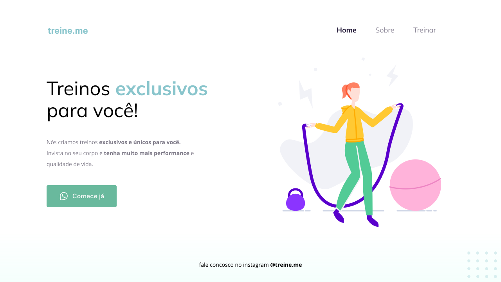

  <a href="#-tecnologias">Tecnologias</a>&nbsp;&nbsp;&nbsp;|&nbsp;&nbsp;&nbsp;
  <a href="#-layout">Layout</a>&nbsp;&nbsp;&nbsp;|&nbsp;&nbsp;&nbsp;
  <a href="#-contribuição">Contribuição</a>

 

  

## 🚀 Tecnologias

Esse projeto foi desenvolvido com as seguintes tecnologias:

- HTML
- CSS

## 🔖 Layout

Você pode visualizar o layout do projeto através [desse link](https://www.figma.com/file/Ai5Of80j0u48mO21w37mHS/Explorer---Projeto-02-(Copy)?type=design&t=23JANr6yB8Y0zHnv-6). É necessário ter conta no [Figma](https://figma.com) para acessá-lo.

## 🤝 Contribuição

Contribuições são o que fazem pessoas evoluirem e incentivam a melhorar, inspirar e criar. Qualquer contribuição que você fizer será **muito apreciada**.

1. Faça um Fork do projeto
2. Crie uma Branch para sua Feature (`git checkout -b feature/FeatureIncrivel`)
3. Adicione suas mudanças (`git add .`)
4. Comite suas mudanças (`git commit -m 'Adicionando uma Feature incrível!`)
5. Faça o Push da Branch (`git push origin feature/FeatureIncrivel`)
6. Abra uma Pull Request

<!-- CONTACT -->
---
## Contato

Feito com ♥ por Sávio de Paula - [Github](thub.com/savio-fju) - **saviofju@gmail.com**
